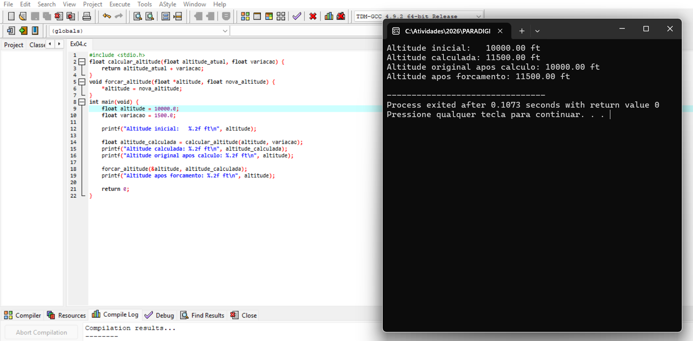
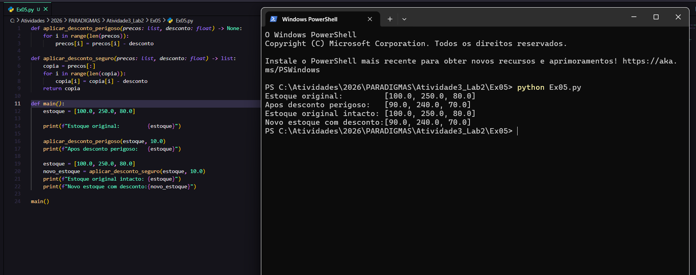
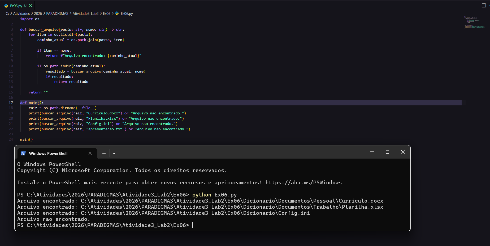
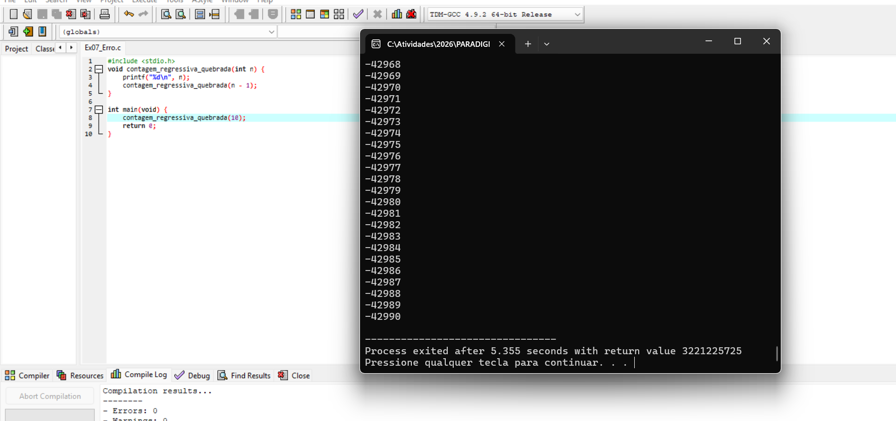
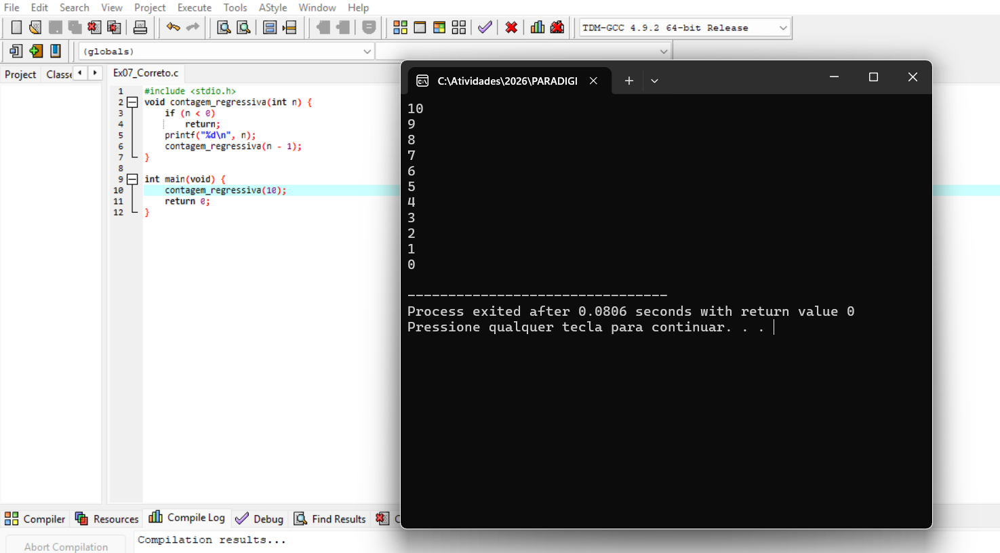
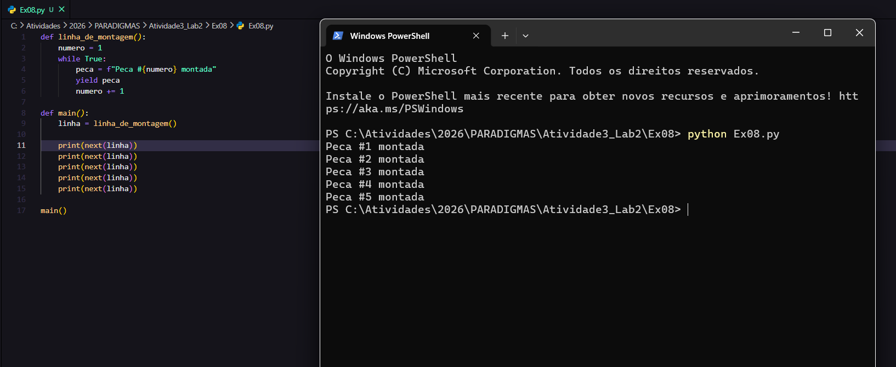
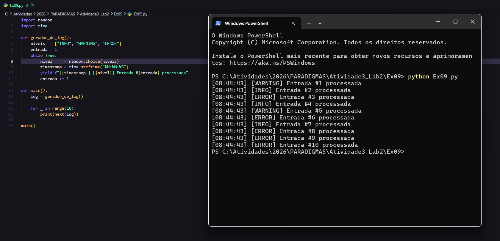
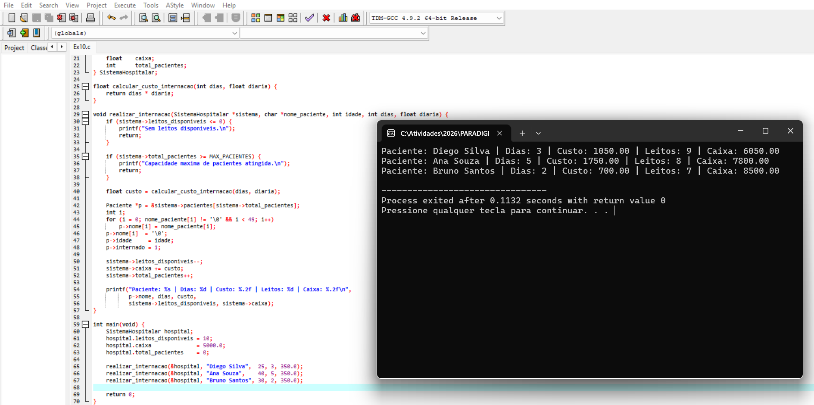

# Atividade 3, Lab 2
### Exercício 1: O Custo Computacional (Iteração vs. Recursão):

#### Análise Exigida:
#### A versão recursiva recalcula os mesmos valores várias vezes do zero, pois para calcular `fib(40)` ela precisa de `fib(39)` e `fib(38)`, e para calcular `fib(39)`  ela precisa de `fib(38)` novamente, e assim por diante. Isso faz o número de chamadas crescer absurdamente, chegando a 331 milhões para `n=40`, onde cada chamada reserva espaço na pilha de memória para guardar seu estado até receber a resposta. A versão iterativa simplesmente percorre o loop 38 vezes somando os dois valores anteriores, sem recalcular nada e sem ocupar a pilha, sendo muito mais rápida e eficiente para valores grandes.
---
### Exercício 2: Proteção de Escopo e Cópia de Parâmetros

#### Análise Exigida:
#### Quando altera_falha e chamada, o compilador copia o valor de saldo_bancario para um novo espaco na pilha de memoria destinado ao parametro formal saldo. As duas variaveis tem o mesmo valor no inicio da chamada, mas sao espacos de memoria completamente diferentes. Qualquer modificacao feita em saldo dentro da funcao afeta apenas essa copia local, que e descartada junto com o Stack Frame da funcao ao retornar. Ja altera_correto recebe o endereco de saldo_bancario com o operador &, entao o *saldo dentro da funcao aponta diretamente para a memoria original no main, e a modificacao persiste apos o retorno.
---
### Exercício 3: Do Código Espaguete à Abstração Procedural
#### 3.1 - Código Caótico:

#### 3.2 - Código Refatorado:

#### Análise:
#### O código espaguete repetia o mesmo bloco de lógica três vezes no main, misturando cálculo de bruto, regra de imposto e impressão sem nenhuma separação de responsabilidades, tornando qualquer alteração na regra de negócio um trabalho manual em três lugares diferentes. A refatoração cria calcular_liquido como função pura que recebe todos os valores por cópia (In Mode) e retorna o salário líquido sem efeito colateral, e imprimir_funcionario como procedimento com responsabilidade exclusiva de montar e exibir o resultado de um funcionário. Com isso o main passa a ter apenas três linhas de orquestração, a regra de imposto existe em um único lugar e qualquer mudança nas taxas ou no limite reflete automaticamente para todos os funcionários.
---
### Exercício 4: O Simulador de Efeito Colateral

#### Análise:
#### A variável altitude nasce e vive exclusivamente no main. A função calcular_altitude recebe seu valor por cópia (In Mode), opera sobre o parâmetro formal sem tocar na variável original e retorna a nova altitude, permitindo inspecionar o resultado antes de qualquer comprometimento de estado. O procedimento forcar_altitude demonstra o efeito colateral via referência: ao receber o endereço de altitude com &, o *altitude aponta diretamente para a memória original no main e a mutação é imediata e permanente. A separação entre as duas funções ilustra a diferença fundamental entre calcular sem risco e alterar com intenção declarada.
---
### Exercício 5: O Perigo do Call-by-sharing

#### Análise Exigida:
#### No Python toda variável guarda uma referência para um objeto na memória, não o valor em si. Quando estoque é passado para aplicar_desconto_perigoso, o parâmetro precos recebe uma cópia dessa referência, ou seja, os dois nomes apontam para o mesmo objeto na memória. Como listas são mutáveis, a atribuição por índice precos[i] = ... modifica o objeto diretamente onde ele vive, refletindo imediatamente em estoque no main de forma irreversível. A versão segura resolve isso criando um novo objeto independente com precos[:] antes de qualquer modificação, garantindo que a lista original permaneça intacta.
---
### Exercício 6: A Elegância Declarativa da Recursão

#### Análise Exigida:
#### O caso base está na linha if item == nome, quando o nome do item atual bate com o arquivo buscado a função retorna imediatamente o caminho encontrado sem abrir nenhuma nova chamada, encerrando a recursão naquele ramo. O segundo caso base implícito é o return "" no final da função, acionado quando os.listdir esgota todos os itens da pasta sem encontrar o arquivo, evitando que a recursão continue indefinidamente em um ramo sem resultado.
#### O passo recursivo está na linha if os.path.isdir(caminho_atual), quando o item atual é uma pasta real no disco a função chama a si mesma passando essa subpasta como nova raiz, descendo um nível na árvore de diretórios a cada chamada até atingir um dos casos base.
---
### Exercício 7: Prevenindo o Stack Overflow
#### 7.1 - Código com Erro:

#### 7.2 - Código Correto:

#### Análise Exigida:
#### Sem o caso base a função chama a si mesma infinitamente, empilhando um novo Stack Frame na pilha de memória a cada chamada sem nunca desempilhar nenhum. Como visto na execução, o programa começou em 10 e desceu pelos negativos até -42990 antes de ser encerrado, o que demonstra que não houve nenhuma condição de parada. Quando a pilha atingiu seu limite de memória o sistema operacional encerrou o processo abruptamente, e embora o DevC++ não tenha exibido uma mensagem de erro textual, o código de saída 3221225725 registrado no terminal corresponde exatamente a 0xC00000FD em hexadecimal, que é o código oficial do Windows para Stack Overflow. Com o caso base if (n < 0) return adicionado, a função para de se chamar ao atingir zero, desempilha todos os frames em ordem inversa e o processo encerra normalmente com código de retorno 0.
---
### Exercício 8: Controle de Fluxo Cooperativo (Yield)

#### Análise Exigida: 
#### Uma sub-rotina tradicional executa do início ao fim em uma única passagem, aloca seu Stack Frame, realiza todo o trabalho e o descarta ao retornar, sem guardar nenhum estado entre chamadas. O gerador funciona de forma cooperativa: ao atingir o yield ele suspende a execução, congela todas as variáveis locais no seu próprio estado interno e devolve o controle ao chamador, mas sem destruir seu Stack Frame. Na próxima chamada via next() ele retoma exatamente da linha seguinte ao yield com todas as variáveis intactas, como se nunca tivesse saído. Isso permite que o chamador e o gerador se alternem no controle da execução de forma controlada, o que seria impossível com uma função tradicional.
---
### Exercício 9: Avaliação Preguiçosa (Lazy Evaluation)

#### Análise Exigida:
#### Se todos os registros fossem carregados de uma vez em uma lista, um arquivo de log com milhões de linhas ocuparia centenas de megabytes ou gigabytes na RAM simultaneamente, podendo travar ou derrubar o sistema. Com o gerador apenas um registro existe na memória por vez: o next() pede um registro, o gerador produz aquele único registro, entrega e congela. O registro anterior já foi processado e descartado pelo programa principal antes do próximo ser gerado. Isso significa que não importa se o log tem mil ou um bilhão de entradas, o consumo de memória permanece constante durante toda a execução.
---
### Exercício 10: O Colapso da Estrutura de Dados

#### Análise Exigida: 
#### Mesmo neste exemplo reduzido com apenas três internações, realizar_internacao já exige um ponteiro para a struct inteira, precisa verificar leitos, capacidade de pacientes e integridade do nome antes de tocar no estado, e qualquer descuido em uma dessas verificações corrompe silenciosamente o caixa ou os dados de um paciente sem nenhum mecanismo de proteção. Em um sistema real com alta médica, transferência, cobrança de exames e escala de médicos, cada nova operação precisaria dos mesmos ponteiros espalhados pelas assinaturas, e nada na linguagem impediria uma função de alterar o caixa ao fazer uma transferência ou liberar um leito sem registrar a alta. O encapsulamento da Orientação a Objetos resolve exatamente isso ao agrupar os dados e as funções que os manipulam em uma única unidade onde o acesso ao estado interno é controlado e protegido.

