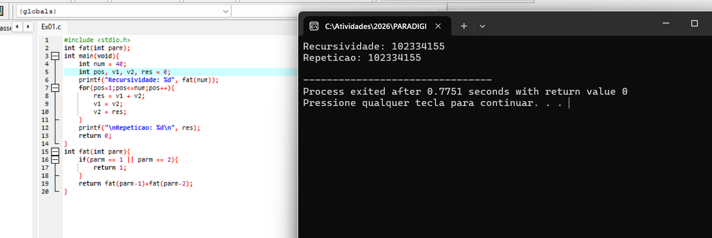
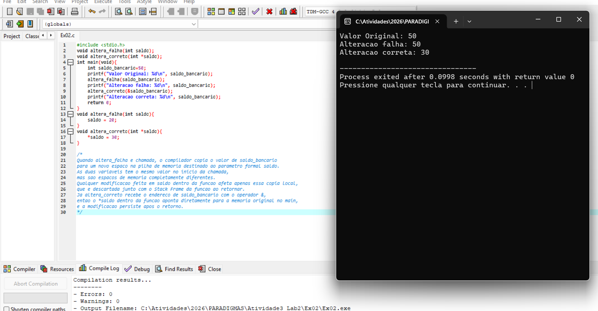
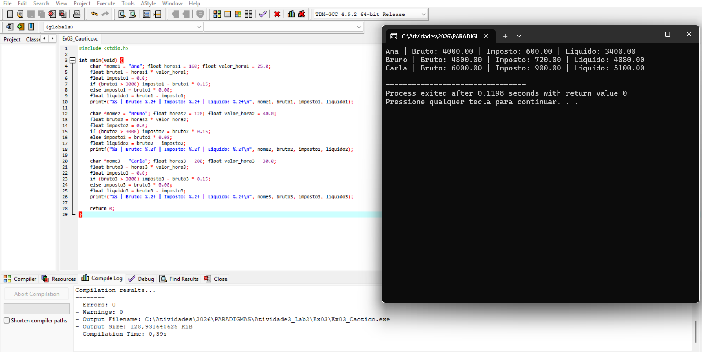
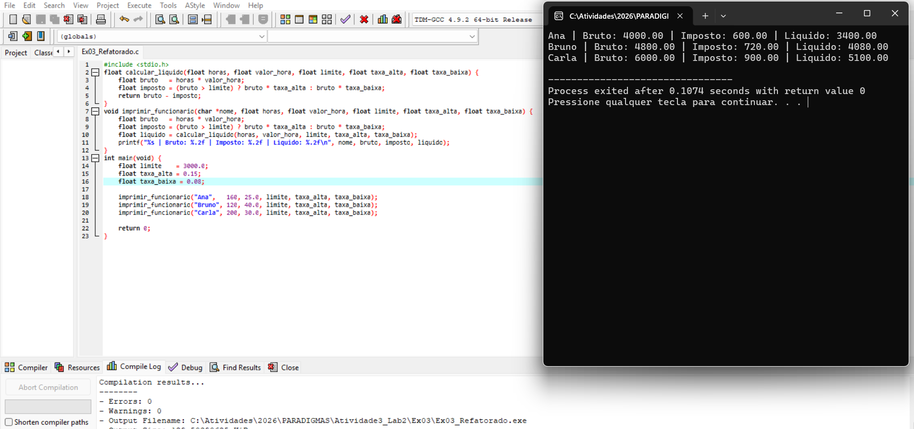

# Atividade 3, Lab 2
### Exercício 1: O Custo Computacional (Iteração vs. Recursão):

#### Análise Exigida:
#### A versão recursiva recalcula os mesmos valores várias vezes do zero, pois para calcular `fib(40)` ela precisa de `fib(39)` e `fib(38)`, e para calcular `fib(39)`  ela precisa de `fib(38)` novamente, e assim por diante. Isso faz o número de chamadas crescer absurdamente, chegando a 331 milhões para `n=40`, onde cada chamada reserva espaço na pilha de memória para guardar seu estado até receber a resposta. A versão iterativa simplesmente percorre o loop 38 vezes somando os dois valores anteriores, sem recalcular nada e sem ocupar a pilha, sendo muito mais rápida e eficiente para valores grandes.
---
### Exercício 2: Proteção de Escopo e Cópia de Parâmetros

#### Análise Exigida:
#### Quando altera_falha e chamada, o compilador copia o valor de saldo_bancario para um novo espaco na pilha de memoria destinado ao parametro formal saldo. As duas variaveis tem o mesmo valor no inicio da chamada, mas sao espacos de memoria completamente diferentes. Qualquer modificacao feita em saldo dentro da funcao afeta apenas essa copia local, que e descartada junto com o Stack Frame da funcao ao retornar. Ja altera_correto recebe o endereco de saldo_bancario com o operador &, entao o *saldo dentro da funcao aponta diretamente para a memoria original no main, e a modificacao persiste apos o retorno.
---
### Exercício 3: Do Código Espaguete à Abstração Procedural
#### 3.1 - Código Caótico:

#### 3.2 - Código Refatorado:

#### O código espaguete repetia o mesmo bloco de lógica três vezes no main, misturando cálculo de bruto, regra de imposto e impressão sem nenhuma separação de responsabilidades, tornando qualquer alteração na regra de negócio um trabalho manual em três lugares diferentes. A refatoração cria calcular_liquido como função pura que recebe todos os valores por cópia (In Mode) e retorna o salário líquido sem efeito colateral, e imprimir_funcionario como procedimento com responsabilidade exclusiva de montar e exibir o resultado de um funcionário. Com isso o main passa a ter apenas três linhas de orquestração, a regra de imposto existe em um único lugar e qualquer mudança nas taxas ou no limite reflete automaticamente para todos os funcionários.
---

